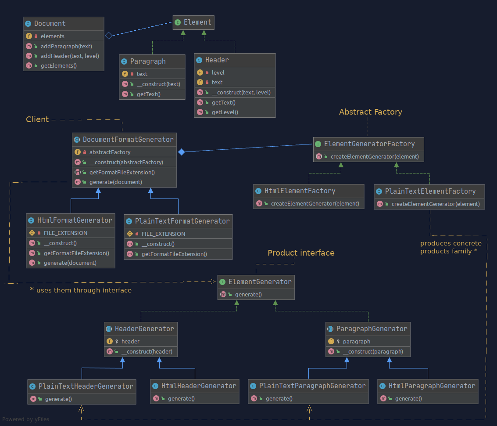
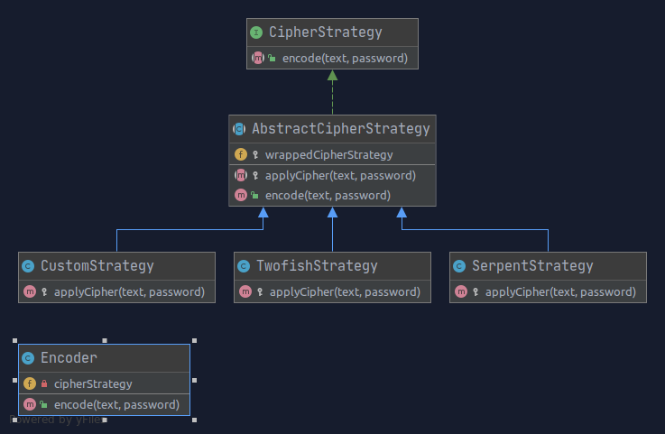
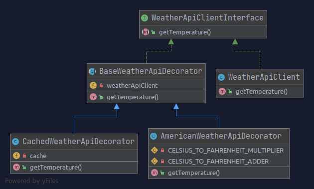

### Examples of design patterns in PHP 7.4

#### src/Document

Example system for creating abstract documents and exporting them in various formats.

pattern: **Abstract Factory** (see branch factory-method-version for **Factory Method**)

pattern overview: 

Client uses Abstract Factory for producing Products, and operates on them using Product Interface. Client isn't aware of which concrete factory, or Product it uses. It is configured at runtime with one of Concrete Factories. 

This helps to separate general document generation logic from a format specific details.

Example use case: `public/index-document.php`

####src/Encoder

Encoder uses injected CipherStrategy to encode data. CipherStrategy can be provided as Decorator, wrapping any number of CipherStrategies one on top of the other.

patterns: **Strategy** + **Decorator**
 

Example use case: `public/index-encoder.php`

#### src/Weather

Weather Api client that can be wrapped using Decorator pattern for cashing or unit conversion.

pattern: **Decorator**

Example use case: `public/index-weather.php`

#### Environment

You can use docker container with php 7.4 if you wish:

`cd <<project directory>>`

run project: `docker-compose run php-dev php public/index-document.php`

run tests: `docker-compose run php-dev php vendor/phpunit/phpunit.php` (jakoś tak TODO)

